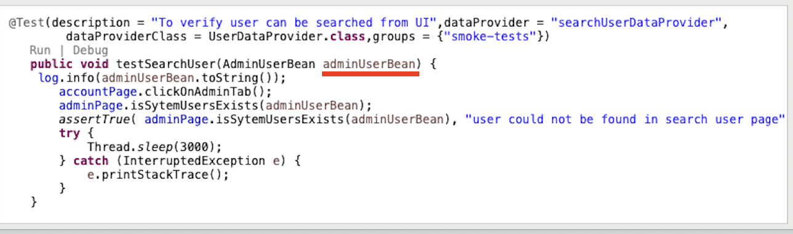

## **AutomateIt**

Test Automation Framework for Web applications using following technologies. 
[1] Selenium 3 
[2] Java 8 
[3] TestNG 
[4] ExtentReport 
[5] Apache Log4J 
[6] Apache POI 

**Description** 
Supports execution of tests on Remote Grid Setup. Includes yaml manifest files for  Selenium Grid 3 setup on kubernetes cluster.
This will enable QA to deploy Selenium to Kubernetes in a scalable fashion.

**Prerequisites** 
Assuming you have a working Kubernetes cluster and a properly configured kubectl client. See the Getting Started Guides for details.
Your cluster nodes must have 4 CPU and 3 GB of RAM each, in order to work properly.
You ca start with one master and one worker node.

All the yaml manifest files can be found under project cluster-setup directory.

>[1] K8S Deployment is used for setting up Selenium hub. 
>[2] K8S ReplicationController is used for setting up  chrome/firefox node. 
>[3] K8S Service of type NodePort is used to acccess Selenium Grid outside of cluster. 

**Pod Debugging** 
Sometimes, we need to debug the flakyness of test during actual execution . This can be achieved by port forwarding from given pod. 
The default VNC port is 5900, we have to do the port forwarding for this particular port to any external port. We ca also specify the IP address to listen on.

`kubectl port-forward --address 192.168.0.105 pod/selenium-rep-chrome-hgwc9 8888:5900`

**Data Driven Approach** 

Each functionality or group of similar functionality is represented and managed in excel worksheet. In Framework, this worksheet is translated to POJO bean class, which will be passed to Test method iteratively through TestNG Dataproviders. Please note that we are using, a Lazy Data provider in TestNG , that loads the data required for a given iteration one set at a time. 
Another advantage of this approach is we don't need to define test method with all column names in method defination, this especially very useful and clean approach when we have multiple columns in excel.

The sample screenshot of Excel worksheet is:

The corresponding Bean class can be represented as:

The corresponding Test method can be represented as:

Please note the test parameter is just one POJO Bean object.

